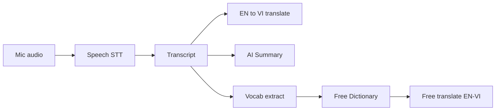

# AI trong Sonic Scribe

Bản đồ chức năng cần AI (Gemini / speech provider) so với phần chạy bằng API miễn phí (không LLM).

Chi tiết cấu hình env: xem [`.env.example`](./.env.example). Health check: `GET /api/v1/health` → `geminiActive`, `speechProvider`.

## Luồng dữ liệu



## 1. Bắt buộc / đang gắn AI trong BE

| Chức năng | Vai trò AI | File chính | Key env |
|-----------|------------|------------|---------|
| **Speech-to-text** (ghi âm live / transcribe) | Audio → chữ | `src/speech/`, `src/live/live.service.ts`, Gemini/Deepgram | `SPEECH_PROVIDER`, `GEMINI_API_KEY` hoặc `DEEPGRAM_API_KEY` |
| **Tóm tắt bản ghi (AI Summary)** | Transcript → bullet tiếng Việt | `src/ai/ai.service.ts` → `summarize()`, gọi từ `recordings.service.ts` | `GEMINI_API_KEY` |
| **Dịch live EN→VI (server)** | Fallback khi Google/MyMemory yếu | `AiService.translateLive()` → Gemini | `GEMINI_API_KEY` (tuỳ chọn; free translators chạy trước) |

### Khi thiếu `GEMINI_API_KEY`

- STT Gemini: không chạy (cần key hoặc đổi `SPEECH_PROVIDER=deepgram` + `DEEPGRAM_API_KEY`, hoặc dùng Web Speech trên FE).
- Summary: fallback `buildLocalSummary` (cắt câu, chất lượng thấp).
- Dịch: vẫn có thể ổn qua Google Translate gtx / MyMemory (free).

### Bật AI tối thiểu

```bash
# be/.env
SPEECH_PROVIDER=gemini
GEMINI_API_KEY=your_key_here
GEMINI_MODEL=gemini-2.0-flash
```

Hoặc Deepgram cho STT:

```bash
SPEECH_PROVIDER=deepgram
DEEPGRAM_API_KEY=your_key_here
GEMINI_API_KEY=your_key_here   # vẫn cần nếu muốn tóm tắt / dịch Gemini
```

Lấy Gemini key: [Google AI Studio](https://aistudio.google.com/apikey).

## 2. Không cần LLM (free / rule-based)

| Chức năng | Cách hiện tại |
|-----------|----------------|
| Tra từ Free Dictionary | `api.dictionaryapi.dev` — FE live, không lưu DB (`fe/src/lib/freeDictionary.ts`) |
| Nghĩa tiếng Việt của từ | Google Translate gtx + MyMemory (`fe/src/lib/translate.ts`) |
| Từ vựng rút gọn từ transcript | Rule extract + Free Dictionary + dịch free (`fe/src/lib/extractVocab.ts`) |
| STT trình duyệt (Web Speech) | Chrome `SpeechRecognition` — không Gemini |
| Auth / storage / Firestore | Không AI |

## 3. Ưu tiên nếu muốn sản phẩm “thông minh”

1. **STT chất lượng** — trái tim app ghi âm (Gemini hoặc Deepgram; hoặc chấp nhận Web Speech kém hơn).
2. **Tóm tắt AI** — khác biệt so với transcript thô (Gemini Flash).
3. **Dịch chuyên ngành** — họp/phỏng vấn: Gemini làm fallback khi thuật ngữ khó.

Không cần AI cho: quản lý bản ghi, phát audio, từ điển tra cứu cơ bản, dung lượng cloud.

## 4. Gợi ý mở rộng sau (chưa có trong code)

- Chat hỏi đáp trên 1 bản ghi
- Trích action items / người nói / thẻ tự động
- Chấm phát âm / gợi ý từ khi học tiếng Anh
- Tóm tắt đa bản ghi (dashboard)

## 5. RBAC + AI token usage

### Roles
- `user` (mặc định) — dùng app bình thường, xem token của chính mình
- `admin` — quản lý role users + xem usage toàn hệ thống

Gán admin qua env (bootstrap):

```bash
ADMIN_EMAILS=you@example.com,demo@sonic.app
```

API:
- `GET /api/v1/admin/users` — list users (admin)
- `POST /api/v1/admin/users` — tạo account `{ name, email, password, role? }`
- `PATCH /api/v1/admin/users/:id` — sửa name/email/password/role
- `PATCH /api/v1/admin/users/:id/role` — `{ "role": "admin" | "user" }`
- `DELETE /api/v1/admin/users/:id` — xoá hẳn account (không tự xoá chính mình)

### AI token screen
- `GET /api/v1/ai/usage` — summary + events của user hiện tại
- `GET /api/v1/ai/usage/all` — admin only

Token được ghi khi gọi Gemini (summarize / translate fallback / transcribe). Free Google/MyMemory không tính.

FE: menu **AI Tokens**; admin thêm menu **Quản trị**.

## Kết luận

**Dùng AI chủ yếu cho 3 việc:** (1) nhận dạng giọng nói, (2) tóm tắt bản ghi, (3) dịch EN→VI chất lượng cao khi free translator không đủ.

**Không bắt buộc AI cho:** tra từ điển, nghĩa VI cơ bản, UI / library / storage.
